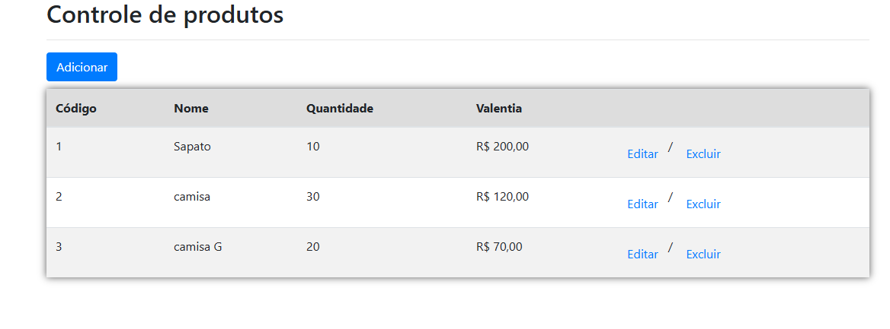
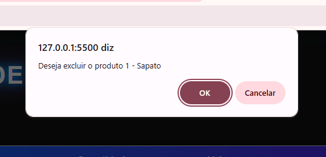

# CRUD - Controle de Produtos

Este projeto é um sistema simples de CRUD (Create, Read, Update, Delete) para controle de produtos, desenvolvido com HTML, CSS, JavaScript e PHP. O sistema é projetado para funcionar sem a necessidade de um banco de dados, armazenando os dados em arquivos JSON.

## Funcionalidades
- **Adicionar Produtos**: 📝 Cadastro de novos produtos com nome, preço, quantidade e imagem.
- **Visualizar Produtos**: 🗃️ Lista de produtos cadastrados.
- **Editar Produtos**: ✏️ Atualização das informações de um produto existente.
- **Excluir Produtos**: ❌ Remoção de produtos da lista.

## Tecnologias Utilizadas
- **HTML5**: 🔖 Estrutura da interface.
- **CSS3**: 🌈 Estilização da interface.
- **JavaScript**: 💡 Funcionalidades dinâmicas na interface.
- **PHP**: 💻 Lógica de backend para manipulação de dados.

## Capturas de Tela aqui:
## Capturas de Tela


### 📋 Controle de Produtos



### ➕ Adicionar Produto


### ❌ Deletar Produto



## Instalação
Siga estas etapas para executar o sistema localmente:

1. **Requisitos**:
   - 🚀 Servidor local com suporte a PHP (ex.: [XAMPP](https://www.apachefriends.org/), [WAMP](https://www.wampserver.com/), ou [Laragon](https://laragon.org/)).

2. **Clonar o Repositório**:
   ```bash
   git clone https://github.com/i2l4/controleDeProdutos.git
   ```

3. **Configurar o Servidor**:
   - 🔧 Copie os arquivos do projeto para a pasta `htdocs` (ou equivalente) do seu servidor local.
   - Certifique-se de que o servidor PHP esteja em execução.

4. **Acessar o Sistema**:
   - 🔗 Abra o navegador e acesse: `http://localhost:3000/produtos.`

## Como Usar
1. 🔍 Abra o sistema no navegador.
2. ✏️ Utilize o formulário para cadastrar novos produtos, preenchendo os campos obrigatórios.
3. 🔄 Navegue pela lista de produtos para visualizar, editar ou excluir itens.


Desenvolvido com ❤ por [Isla](https://github.com/i2l4).

